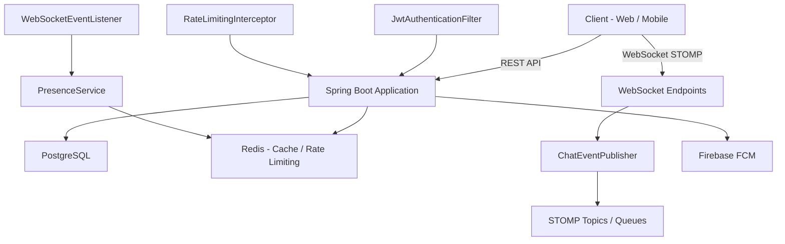

# RealTime Message Application

A real-time messaging backend built with **Spring Boot 3.5**, **WebSocket (STOMP)**, **PostgreSQL**, **Redis**, and **Firebase Cloud Messaging (FCM)**. Supports private and group conversations with features like message pinning, read receipts, user blocking, muting, and rate limiting.

---

## Tech Stack

| Category          | Technology                                                    |
| ----------------- | ------------------------------------------------------------- |
| Framework         | Spring Boot 3.5.11, Spring Security, Spring Data JPA          |
| Language          | Java 21                                                       |
| Real-time         | WebSocket (STOMP over SockJS)                                 |
| Database          | PostgreSQL 18                                                 |
| Cache / Pub-Sub   | Redis (Redisson 3.52.0)                                       |
| Push Notification | Firebase Cloud Messaging (firebase-admin 9.7.0)               |
| Rate Limiting     | Bucket4j 8.14.0 (distributed via Redisson)                    |
| Authentication    | JWT (jjwt 0.13.0), OAuth2 Resource Server                    |
| Build             | Maven Wrapper (`./mvnw`)                                      |
| Containerization  | Docker, Docker Compose                                        |

---

## Features

### Messaging
- **Real-time chat** over WebSocket (STOMP) for private and group conversations
- **Message types:** TEXT, IMG, FILE
- **Edit & delete** messages with soft-delete and restore
- **Pin / unpin** messages within a conversation
- **Read receipts** per message per user

### Conversations
- **Private** (1-on-1) and **Group** conversations
- **Participant management:** add, remove, leave
- **Roles:** ADMIN, MEMBER
- **Mute / unmute** conversations
- **Archive** conversations
- **Mark as favorite**
- **Update** title, description, and image

### User Management
- User profile with bio and profile picture
- **Block / unblock** other users
- **Ban / unban** users from conversations (group moderation)
- **Online presence** tracking via WebSocket connect/disconnect events

### Security & Infrastructure
- **JWT-based authentication** with access and refresh tokens
- **OAuth2 Resource Server** support
- **Rate limiting** per user/IP via Bucket4j backed by Redis
- **Push notifications** via Firebase Cloud Messaging (FCM)
- **Scheduled tasks** for cleanup and maintenance

---

## Architecture Overview



### Key Components

| Component                | Path / File                                                                                       | Purpose                                                               |
| ------------------------ | ------------------------------------------------------------------------------------------------- | --------------------------------------------------------------------- |
| `ChatEventPublisher`     | [`component/ChatEventPublisher.java`](src/main/java/com/example/realtime_message_application/component/ChatEventPublisher.java)     | Broadcasts chat events to group topics or user queues                 |
| `WebSocketEventListener` | [`component/WebSocketEventListener.java`](src/main/java/com/example/realtime_message_application/component/WebSocketEventListener.java) | Tracks user online/offline presence on connect/disconnect             |
| `JwtService`             | [`security/JwtService.java`](src/main/java/com/example/realtime_message_application/security/JwtService.java)                       | Generates and validates JWT access/refresh tokens                     |
| `RateLimitingService`    | [`service/RateLimitingService.java`](src/main/java/com/example/realtime_message_application/service/RateLimitingService.java)       | Bucket4j-based rate limiting with Redis backend                       |
| `FCMService`             | [`service/FCMService.java`](src/main/java/com/example/realtime_message_application/service/FCMService.java)                         | Sends push notifications via Firebase                                |
| `PresenceService`        | [`service/PresenceService.java`](src/main/java/com/example/realtime_message_application/service/PresenceService.java)               | Manages user online status in Redis                                  |

---

## Prerequisites

- **Java 21** (or higher)
- **Maven 3.9+** (the project includes Maven Wrapper `./mvnw`)
- **PostgreSQL 18** (or Docker for auto-setup)
- **Redis 7+** (or Docker for auto-setup)
- **Firebase** service account key (`serviceAccountKey.json`) for push notifications

---

## Getting Started

### 1. Clone and Configure

```bash
git clone <repository-url>
cd realtimemessage
```

### 2. Set Up Environment Variables

Create a `.env` file in the project root (used by Docker Compose):

```env
POSTGRES_USER=postgres
POSTGRES_PASSWORD=12345
POSTGRES_DB_NAME=realtimemessage
REDIS_PORT=6379
JWT_SECRET_KEY=your-256-bit-secret-key-here
```

For local development without Docker, update [`application.properties`](src/main/resources/application.properties):

| Property                          | Default Value                                      | Description                    |
| --------------------------------- | -------------------------------------------------- | ------------------------------ |
| `SPRING_DATASOURCE_URL`           | `jdbc:postgresql://localhost:5432/realtimemessage` | PostgreSQL JDBC URL            |
| `SPRING_DATASOURCE_USERNAME`      | `postgres`                                         | Database username              |
| `SPRING_DATASOURCE_PASSWORD`      | `12345`                                            | Database password              |
| `SPRING_DATA_REDIS_HOST`          | `localhost`                                        | Redis host                     |
| `SPRING_DATA_REDIS_PORT`          | `6379`                                             | Redis port                     |
| `JWT_SECRET`                      | *(256-bit hex key)*                                | Secret key for JWT signing     |
| `jwt.expirationInSec`             | `864000` (10 days)                                 | Access token expiration        |
| `jwt.refreshExpirationInSec`      | `864000` (10 days)                                 | Refresh token expiration       |
| `app.firebase-configuration-file` | `serviceAccountKey.json`                           | Path to Firebase service key   |

### 3. Run with Docker Compose (Recommended)

```bash
docker compose -f docker-compose.postgreSQL.yml --env-file .env up -d
```

This starts PostgreSQL, Redis, and the application container on port `8080`.

### 4. Run Locally (Development)

```bash
# Ensure PostgreSQL and Redis are running, then:
./mvnw spring-boot:run
```

The application starts on **http://localhost:8080**.

---

## API Endpoints

### Authentication
All REST endpoints (except WebSocket handshake) require a valid JWT token in the `Authorization: Bearer <token>` header. WebSocket connections pass the token via STOMP headers.

### Controllers

| Controller                 | Base Path              | Description                                  |
| -------------------------- | ---------------------- | -------------------------------------------- |
| [`UserController`](src/main/java/com/example/realtime_message_application/controller/UserController.java)           | `/api/users`           | User profile management                     |
| [`ConversationController`](src/main/java/com/example/realtime_message_application/controller/ConversationController.java) | `/api/conversations`   | Create, update, archive, favorite, mute     |
| [`ParticipantController`](src/main/java/com/example/realtime_message_application/controller/ParticipantController.java)  | `/api/conversations/{id}/participants` | Add, remove, change role        |
| [`MessageController`](src/main/java/com/example/realtime_message_application/controller/MessageController.java)       | `/api/conversations/{id}/messages`     | Send, edit, delete, pin, read receipt |
| [`ChatController`](src/main/java/com/example/realtime_message_application/controller/ChatController.java)           | WebSocket `/ws`        | Real-time message handling over STOMP       |
| [`BlockController`](src/main/java/com/example/realtime_message_application/controller/BlockController.java)          | `/api/blocks`          | Block / unblock users                       |
| [`BanController`](src/main/java/com/example/realtime_message_application/controller/BanController.java)            | `/api/bans`            | Ban / unban users from group conversations  |
| [`FCMController`](src/main/java/com/example/realtime_message_application/controller/FCMController.java)            | `/api/fcm`             | Register / unregister FCM device tokens     |

---

## WebSocket (STOMP)

The WebSocket endpoint is available at `/ws` with SockJS fallback.

- **Broker prefix:** `/topic`, `/queue`
- **Application destination prefix:** `/app`
- **Handshake interceptor:** [`JwtHandshakeInterceptor`](src/main/java/com/example/realtime_message_application/security/JwtHandshakeInterceptor.java) validates JWT during WebSocket upgrade

### STOMP Destinations

| Destination                              | Type    | Description                              |
| ---------------------------------------- | ------- | ---------------------------------------- |
| `/topic/conversations.{convId}`          | Topic   | Group conversation messages              |
| `/user/queue/conversation.{convId}`      | Queue   | Private conversation messages per user   |
| `/app/chat.sendMessage`                  | App     | Send a new message                       |
| `/app/chat.editMessage`                  | App     | Edit an existing message                 |
| `/app/chat.deleteMessage`                | App     | Soft-delete a message                    |

---

## Database Models

| Entity                      | Table                  | Description                               |
| --------------------------- | ---------------------- | ----------------------------------------- |
| `User`                      | `users`                | Application user with profile info        |
| `Conversation`              | `conversations`        | Chat conversation (PRIVATE / GROUP)       |
| `ConversationParticipant`   | `conversation_participants` | Many-to-many join with role          |
| `Message`                   | `messages`             | Chat message with type and soft-delete    |
| `ReadReceipt`               | `read_receipts`        | Per-user read status per message          |
| `Block`                     | `blocks`               | User blocking relationships               |
| `BannedUser`                | `banned_users`         | Banned users in conversations             |
| `FCMToken`                  | `fcm_tokens`           | Firebase device tokens per user           |

---

## Project Structure

```
src/main/java/com/example/realtime_message_application/
├── RealtimemessageApplication.java    # Main entry point
├── component/
│   ├── ChatEventPublisher.java        # STOMP message broadcasting
│   └── WebSocketEventListener.java    # Presence tracking
├── config/
│   ├── FCMInitializer.java            # Firebase Admin SDK init
│   ├── RateLimitingFilter.java        # Bucket4j filter
│   ├── RateLimitingInterceptor.java   # Bucket4j interceptor
│   ├── RedisConfig.java               # Redis / Redisson config
│   ├── SecurityConfig.java            # Spring Security config
│   ├── UserInterceptor.java           # User context resolver
│   ├── WebConfig.java                 # Web MVC config
│   └── WebsocketConfig.java           # STOMP / WebSocket config
├── controller/                        # REST controllers
├── dto/                               # Request / Response DTOs
│   ├── conversation/
│   ├── message/
│   ├── notification/
│   └── user/
├── enums/
│   ├── ConversationType.java          # PRIVATE, GROUP
│   ├── MessageType.java               # TEXT, IMG, FILE
│   └── ParticipantRole.java           # ADMIN, MEMBER
├── exception/                         # Custom exceptions
├── mapper/                            # Entity <-> DTO mappers
├── model/                             # JPA entities
├── repository/                        # Spring Data repositories
├── security/
│   ├── CustomUserDetails.java
│   ├── CustomUserDetailsService.java
│   ├── JwtAuthenticationFilter.java
│   ├── JwtHandshakeInterceptor.java
│   ├── JwtService.java
│   └── SecurityUtils.java
└── service/                           # Business logic
    └── impl/                          # Service implementations
```

---

## Running Tests

```bash
./mvnw test
```

The test suite includes unit tests for services and controllers under `src/test/java/`.

---

## Build for Production

```bash
./mvnw clean package -DskipTests
java -jar target/*.jar
```

Or build and run the Docker image:

```bash
docker build -t realtimemessage .
docker run -p 8080:8080 \
  -e SPRING_DATASOURCE_URL=jdbc:postgresql://host:5432/realtimemessage \
  -e SPRING_DATASOURCE_USERNAME=postgres \
  -e SPRING_DATASOURCE_PASSWORD=12345 \
  -e SPRING_DATA_REDIS_HOST=redis-host \
  -e JWT_SECRET=your-secret \
  realtimemessage
```

---

## License

This project is provided as a demo / educational reference.
